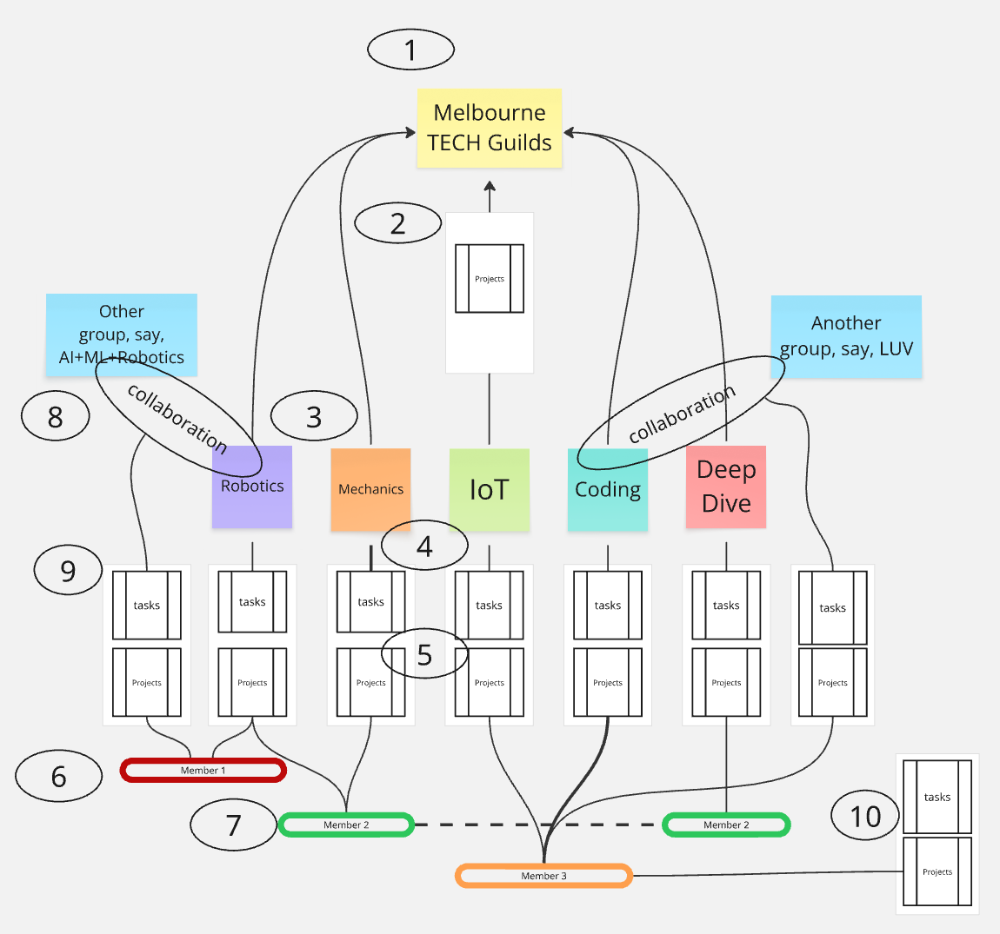

# Group, Guild, Member function

1. The group may jointly decide to build a project
2. In collaboration with the guilds a basic mvp design is created and the build tasks determined
3. Those tasks may be accepted for action by the Guilds
4. Guild tasks should be prioritised and actioned by at least two volunteers from their Members
5. The Guilds can have their own projects
6. Members will usually be engaged in more than one Guild
7. Members are encouraged to collaborate on the guild tasks
8. Collaboration with external Groups is encouraged as it builds community, knowledge and alternative insights
9. Guilds can participate in other Group’s projects by accepting tasks from that group\.
10. Members will usually have their own projects and tasks

